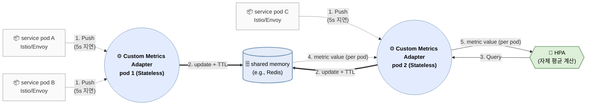

# Introduction

Active request를 CPU + Memory를 대신하는 HPA의 단일 지표로 쓰는 것이 좋다는 주장과 함께, KEDA의 약점인 수집 지연 개선을 위한 custom metric adapter를 도입함으로 초고속 autoscaling을 얻기 위한 방법을 논한다. 기존 방식(`metrics-server` 기반)보다 짧게는 20s, 길게는 1분 이상 먼저 부하 인지가 가능하여, Spike 대응에 매우 효과적이다.

# 왜 Active Request인가?

- **리틀의 법칙(Little’s Law):** $L(active\;request) = λ(RPS)×W(latency)$에 근거. 즉, active request는 처리량과 지연 모두를 반영하는 지표임. 처리량이 올라가도 증가하고, 지연이 증가해도 올라가는 지표.
- **CPU / memory보다 지표로 매우 우수**: active request는 장애가 터지기 *10~60초 전에* 먼저 임계 신호를 만드는 반면, CPU·memory는 장애 후 또는 직전에야 만듦. 특히 memory는 scale-in 관점에서도 지나치게 느림.
    - **CPU/Memory는 하기 이유로 지연이 발생**
        - **누적·평균 지표 구조:** CPU/Memory는 순간 이벤트가 아니라 *특정 시간 window 동안 누적된 사용량의 평균*이 임계치를 넘을 때만 신호가 만들어짐.
        - **런타임 완충 메커니즘:** GC,캐시, 버퍼 등으로 과부하를 잠시 흡수해 *실제 고갈 전까지 임계 신호 생성을 지연*.
        - **포화 이후 비선형 증폭:** CPU throttling, page fault, reclaim 같은 현상은 *이미 성능이 무너진 뒤에야* 급격히 지표가 튐.
    - **scale-in의 경우는 더욱 크게 CPU, Memory에서 지연이 발생**
        - **누적·평균 잔상:** 부하가 줄어도 CPU/Memory는 *이전 window의 높은 사용량이 섞여* 한동안 높은 값으로 남음.
        - **메모리 반환 지연:** 요청이 줄어도 힙·캐시·page cache가 *즉시 회수되지 않아* working set이 오래 유지.
        - **비대칭 반응성:** CPU는 비교적 빨리 내려오지만, Memory는 *하강 경로가 매우 완만*해 scale-in 신호 생성이 특히 늦어짐.
- **Runtime 환경 의존성 없음**: runtime 환경(e.g. java, go, python)에 대한 의존성이 없어 universal하게 사용 가능
- **KPA의 단일 지표**: **active request는 KPA(Knative Pod Autoscaler)의 단일 지표**로 사용 중(default의 경우). KPA는 k8s 기반 서버리스 운용을 위해 사실 상 de facto 표준으로 사용된다고.

<aside>
💡

**참고: `concurrent` request = (`active` + `pending`) request**

- **active request:** Envoy가 현재 업스트림으로 전달되어 실제 처리 중인 in-flight 요청
- **pending request:** 업스트림 커넥션/슬롯 부족 등으로 아직 전달되지 못하고 upstream 큐에서 대기 중인 요청(envoy/istio에는 downstream에는 없고, 오직 upstream에만 존재)
- `istio_requests_total`: 완료 기준. concurrent request는 처리/대기 중 기준.
</aside>

# KPA의 대안: Istio + KEDA 조합

KPA는 HPA 대비 0개의 min replica와 함께 KEDA도 못하는 Request Queuing(activator)을 제공하지만, **모든 파드에 전용 사이드카(Queue Proxy)를 강제**함과 동시에 active request를 얻기 위해 (Istio로 대체 가능하지만) 별도의 Envoy를 사용한다. 외부 Envoy에 pod 별 sidecar 추가는 매우 불편한 감정이 든다. 따라서,

- **현실적 타협**: Istio Envoy가 기본으로 제공하는 active request 지표인 `envoy_http_downstream_rq_active` (아래부터 `rq_active` 로 표기) + KEDA 사용. Request Queuing 기능이 없어 request 유실 방지는 못함.
- Autoscaling은 `rq_active`**만으로 scale-out**하고, **scale-in은** `rq_active` **+** `stabilizationWindowSeconds`으로 thrashing을 방지
- KPA도 같은 철학으로, 다른 점은 `stabilizationWindowSeconds` 대신 request queuing으로 안정성을 확보한다는 점 뿐. 그런데!

KEDA는 **자체 polling 주기를 가질 뿐 아니라, 전용 DB(Prometheus 등)의 수집 주기**에 종속됨. **이들 두 주기를 기다리면 '초고속 스케일링'은 불가능한건 물론이요 더욱 느려질 위험도 있으니…**

# 상기 한계의 해결: Custom Metric Adapter 도입



## **동작 원리**

Custom Metric adapter는 Prometheus를 대신하여 metric을 메모리에 들고 있다가, HPA가 요청하면 즉시 응답. 또한, Metric scraping 대신 Istio/Envoy가 metric을 push함으로 polling에 따른 지연 제거.

추가로, Pod 비정상 종료를 대비해 각 지표에 **TTL(Time-To-Live)**을 적용함으로 비정상 데이터 제공 최소화.

**Note**: Envoy Metric Service의 프로토콜에 따라 metric sink 구현이 요구됨. 다음은 Istio Proxy(Envoy)에서 custom metric adapter로 metric push를 위한 설정 예.

```yaml
apiVersion: networking.istio.io/v1beta1
kind: ProxyConfig
metadata:
  name: metrics-push
  namespace: istio-system
spec:
  envoyMetricsService:
    address: custom-metric.observability.svc.cluster.local:9000

  proxyStatsMatcher:
    inclusionRegexps:
      - ".*downstream_rq_active.*"
```

## 고가용성(HA)과 Shared Memory의 난제는 어떻게?

Custom Metric adapter는 핵심 컴포넌트이기에 HA 구성이 필수적이지만, 다음 이유로 **자체 shared Memory 구현**은 난감.

- **분산 합산의 어려움**: 지표가 여러 Custom Metric adapter 복제본으로 분산되어 들어올 때, 전체 합산값을 구하기 위해 복제본 간 데이터 동기화가 필요.
- **Consistent Hashing 요구**: Envoy가 지표를 보낼 때나, HPA가 조회할 경우 모두에서 특정 pod를 찾아가야하는 consistent hashing 요구 발생.
- **해법**: 복잡한 분산 로직 운영 대신 **Redis를 shared Memory로 사용.**
- **구조**: Custom Metric adapter는 단순한 인터페이스(gRPC/HTTP) 역할만 수행하며, 모든 상태는 Redis가 관리. 이를 통해 완전한 무상태(Stateless) HA 구성이 가능.

## 구현 방향

Istio/Envoy와 kube-apiserver용의 2개의 endpoints 노출. 관련 생태계가 golang이 잘 되어 있으므로 golang기반으로 구현.

- **Istio/Envoy용 API bizlogic**

    https://github.com/envoyproxy/go-control-plane

    1. gRPC StreamMetrics 요청을 받으면
    2. 메시지의 `node.metadata`에서 `POD_NAME` , `POD_NAMESPACE`를 읽고
    3. `rq_active` 값과 함께 key = `{namespace, pod}`로 Redis에 저장(TTL 포함)
- **kube-apiserver용 API bizlogic**

    https://github.com/kubernetes-sigs/custom-metrics-apiserver

    - [External metrics API](https://kubernetes.io/docs/reference/external-api/external-metrics.v1beta1/)는 KEDA 등 타 `APIService`가 사용할 가능성이 높으므로 [Custom metrics API](https://kubernetes.io/docs/reference/external-api/custom-metrics.v1beta2/) 사용(대신 타 Custom metrics Adapter를 못 씀. 예컨데 Prometheus Adapter - 이게 필요하면 KEDA 쓰면 되긴 하지만).
    - `GET /apis/custom.metrics.k8s.io/v1beta2/namespaces/default/pods/*/active_requests?labelSelector=...` 같은 요청이 오면,
    - namespace, pod를 key로 Redis 조회
    - HPA 대상 Deployment의 pod들 각각에 대해 `rq_active` 값을 **리스트로 반환**(각 pod 이름별. HPA가 평균을 계산). 참고로 metrics adapter가 합산하면 HPA manifest의 kind를 service로 해야하기에 제약이 발생(workload 특정이 어려움).

# 관련 k8s manifest 예시

## API service 등록

```yaml
apiVersion: apiregistration.k8s.io/v1
kind: APIService
metadata:
  name: v1beta2.custom.metrics.k8s.io
spec:
  group: custom.metrics.k8s.io
  version: v1beta2
  service:
    name: my-activescale
    namespace: monitoring
  groupPriorityMinimum: 100
  versionPriority: 100
  caBundle: <BASE64_CA_BUNDLE>
```

## HPA manifest 예시

```yaml
apiVersion: autoscaling/v2
kind: HorizontalPodAutoscaler
metadata:
  name: my-svc-hpa
  namespace: default
spec:
  scaleTargetRef:
    apiVersion: apps/v1
    kind: Deployment # StatefulSet도 가능
    name: my-svc
  minReplicas: 2
  maxReplicas: 50
  metrics:
  - type: Pods
    pods:
      metric:
        name: active_requests   # custom.metrics.k8s.io에서 "pod/<podName>" 단위로 제공하는 값
      target:
        type: AverageValue
        averageValue: "10"      # 예: pod당 active_requests 평균이 10 넘으면 scale-out
```

# References

[An SLO Driven and Cost-Aware Autoscaling Framework for Kubernetes](https://arxiv.org/html/2512.23415v1)

[On the Analysis of Inter-Relationship between Auto-Scaling Policy and QoS of FaaS Workloads](https://pmc.ncbi.nlm.nih.gov/articles/PMC11207725/)