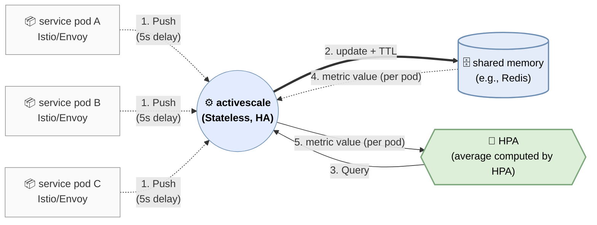

# Activescale

Activescale enables fast Kubernetes autoscaling with push-based, per-pod active request and connection metrics from Envoy.

`Active` means currently in flight: requests not yet completed and connections still open. By Little's Law (`L = λW`), active requests reflect both request rate and latency.

Unlike CPU and memory metrics collected through metrics-server, Envoy pushes active signals directly to Activescale, avoiding extra scrape and polling delays.

## Documentation

- **Guide**: [한국어](doc/guide-kr.md) | [English](doc/guide-en.md) — metric selection, HPA configuration, and verification
- **Motivation**: [한국어](doc/motivation-kr.md) | [English](doc/motivation-en.md) — rationale, latency comparison, and architecture
- **Test results**: [한국어](doc/test-results-kr.md) | [English](doc/test-results-en.md) — scaling responsiveness, Scale-out Coverage, and estimated resource utilization summary
- **Kubernetes manifest example**: [k8s-manifest-example.yaml](k8s-manifest-example.yaml) — deployment and HPA example requiring Redis, ServiceAccount/RBAC, serving certificates, and a target workload

## Features

- Active request concurrency as an autoscaling signal that reflects both request rate and request latency
- Push-based Envoy `StreamMetrics` ingestion without intermediary Prometheus scrape and KEDA polling delays
- Pod-scoped Custom Metrics API values that HPA averages across workload replicas
- Direction-aware `inbound_active_requests` and `outbound_active_requests`, plus aggregate `active_connections`
- Stateless high availability with shared Redis/Valkey state and TTL-based stale metric expiry
- Redis standalone and Cluster modes with optional TLS
- Configurable gRPC receive limit and Klog-based summary and debug logging

## Metrics

- `inbound_active_requests`: inbound in-flight HTTP requests from `http.inbound_*.downstream_rq_active`
- `outbound_active_requests`: outbound in-flight HTTP requests from `http.outbound_*.downstream_rq_active`
- `active_connections`: open connections across aggregate Envoy service listeners from `listener.<address>.downstream_cx_active`

All metrics are exposed as pod-scoped custom metrics for HPA.

### Choosing a request metric

Choose the metric based on the role of the workload being scaled.

| Workload | Metric | When to use |
| --- | --- | --- |
| Application or API service | `inbound_active_requests` | Use for a workload that receives and processes client requests. This is the default choice for typical services. |
| Dedicated gateway or proxy | `outbound_active_requests` | Use when the workload primarily forwards client requests to upstream services and `inbound_active_requests` is unavailable or does not reflect the traffic. |

Do not configure both metrics as a fallback. For a normal application, outbound requests usually represent calls to dependencies and can trigger scaling for unrelated downstream traffic.

If the workload role is unclear, generate a small amount of client traffic and query both metrics. Select the one that returns per-pod values and increases with the client request concurrency being tested.

```bash
kubectl get --raw '/apis/custom.metrics.k8s.io/v1beta2/namespaces/<ns>/pods/*/inbound_active_requests?labelSelector=<selector>'

kubectl get --raw '/apis/custom.metrics.k8s.io/v1beta2/namespaces/<ns>/pods/*/outbound_active_requests?labelSelector=<selector>'
```

## Architecture


```mermaid
graph LR
    PodA["📦 service pod A<br/>Istio/Envoy"]
    PodB["📦 service pod B<br/>Istio/Envoy"]
    PodC["📦 service pod C<br/>Istio/Envoy"]

    Agg(("⚙️ <b>activescale<b/><br/>(Stateless, HA)"))

    Redis[("🗄️ shared memory<br/>(e.g., Redis)")]

    KEDA{{"🚀 HPA<br/>(average computed by HPA)"}}

    PodA -."1. Push<br/>(5s delay)".-> Agg
    PodB -."1. Push<br/>(5s delay)".-> Agg
    PodC -."1. Push<br/>(5s delay)".-> Agg

    Agg ==>|2. update + TTL| Redis

    KEDA --"3. Query"--> Agg
    Redis -."4. metric value (per pod)".-> Agg
    Agg --"5. metric value (per pod)"--> KEDA

    style Redis fill:#E3ECF8,stroke:#6E8FB3,stroke-width:2px,color:#000
    style KEDA fill:#DDEFD8,stroke:#7DA67D,stroke-width:2px,color:#000
    style Agg fill:#E3ECFF,stroke:#6E8FB3,color:#000
    style PodA fill:#FAFAFA,stroke:#999
    style PodB fill:#FAFAFA,stroke:#999
	  style PodC fill:#FAFAFA,stroke:#999
```

## Envoy Metrics Message Shape

Activescale receives Envoy gRPC `StreamMetrics` messages. Each message contains a node identity and a list of metric families. A simplified shape:

```json
{
  "identifier": {
    "node": {
      "id": "sidecar~10.0.0.1~my-pod.my-ns~my-ns.svc.cluster.local",
      "metadata": {
        "NAME": "my-pod",
        "NAMESPACE": "my-ns"
      }
    }
  },
  "envoy_metrics": [
    {
      "name": "http.inbound_0.0.0.0_8080;.downstream_rq_active",
      "metric": [
        { "gauge": { "value": 3 } }
      ]
    },
    {
      "name": "http.outbound_0.0.0.0_8080;.downstream_rq_active",
      "metric": [
        { "gauge": { "value": 4 } }
      ]
    },
    {
      "name": "listener.0.0.0.0_8080.downstream_cx_active",
      "metric": [
        { "gauge": { "value": 12 } }
      ]
    },
    {
      "name": "cluster.xds-grpc;.circuit_breakers.default.cx_pool_open",
      "metric": [
        { "gauge": { "value": 1 } }
      ]
    }
  ]
}
```

Pod identity extraction prefers `node.metadata.NAME` and `node.metadata.NAMESPACE`.
If either metadata field is missing, activescale falls back to parsing the Istio-style `node.id`
(`sidecar~<ip>~<pod>.<namespace>~<namespace>.svc.cluster.local`).

### Summary Counters Meaning

- `messages`: number of `StreamMetrics` messages received (one `Recv()` call).
- `stored_metrics`: number of metric writes stored in Redis for accepted request and connection samples.
- `dropped_by_ids`: messages dropped because pod identity could not be extracted.
- `dropped_by_names`: metric families skipped because their name did not match the inbound, outbound, or aggregate service listener rules.

`stored` does not necessarily equal `messages` because a message can contain multiple metric families or multiple samples, and `dropped_by_names` is counted per metric family, not per message.

## Debugging

Check Custom Metrics API is registered:
```bash
kubectl get --raw '/apis/custom.metrics.k8s.io/v1beta2'
```

Query inbound active requests with a selector:
```bash
kubectl get --raw '/apis/custom.metrics.k8s.io/v1beta2/namespaces/<ns>/pods/*/inbound_active_requests?labelSelector=app=<app>'
```

Query outbound active requests with a selector:
```bash
kubectl get --raw '/apis/custom.metrics.k8s.io/v1beta2/namespaces/<ns>/pods/*/outbound_active_requests?labelSelector=app=<app>'
```

Query active connections with a selector:
```bash
kubectl get --raw '/apis/custom.metrics.k8s.io/v1beta2/namespaces/<ns>/pods/*/active_connections?labelSelector=app=<app>'
```

Check activescale ingest logs:
```bash
kubectl logs -n ns-observability deploy/activescale | rg -n "stored (inbound_active_requests|outbound_active_requests|active_connections)|skipping metric name|missing pod identity"
```

Enable debug logs and restart:
```bash
kubectl -n ns-observability set env deploy/activescale LOG_VERBOSITY=4
kubectl -n ns-observability rollout restart deploy/activescale
```

Confirm Envoy bootstrap includes the metrics service:
```bash
istioctl proxy-config bootstrap <pod> -n <ns> | rg -n "envoyMetricsService|metrics_service|envoy_grpc|cluster_name|activescale|9000"
```

A minimal Kubernetes reference example lives in
`k8s-manifest-example.yaml`.

## Notes

Activescale reads both Envoy HTTP connection manager and listener stats, depending on the metric.

- Activescale exposes inbound and outbound HTTP connection-manager request metrics separately.
- `http.admin.*`, `http.agent.*`, and Prometheus-style `envoy_http_downstream_rq_active` aliases are ignored.
- `active_connections` accepts aggregate `listener.<address>.downstream_cx_active` families for service listener ports.
- Worker breakdowns such as `listener.<address>.worker_0.downstream_cx_active` and [Istio-reserved proxy ports](https://istio.io/latest/docs/ops/deployment/application-requirements/#ports-used-by-istio) for admin, failure detection, debug, telemetry, health, and DNS are ignored.
- Traffic-path listeners for outbound (`15001`), inbound (`15006`), and HBONE (`15008`) remain eligible.

## Appendix

### Missing metric values

Envoy can omit an active stat family for a new or idle pod. Activescale refreshes a per-pod heartbeat on every `StreamMetrics` message and applies the metric TTL to that heartbeat. The default TTL is `20s` and can be changed with `METRIC_TTL` or `--ttl`.

- A fresh heartbeat with no metric key is returned as `0` because collection is healthy and the pod has no observed active work.
- A missing or expired heartbeat remains missing and can produce `HTTP 404 NotFound` because returning `0` would hide an Envoy collection outage and could cause an unsafe HPA scale-in.

Heartbeat-gated zeros prevent healthy idle pods from causing `FailedGetPodsMetric` or conservative scale-in delays without treating stale telemetry as zero. Provider summary logs count these values as `synthesized_zeros`.

#### Handling `HTTP 404 NotFound`

`HTTP 404 NotFound` means telemetry is unavailable, not that the metric value is zero.

Kubernetes HPA retries automatically and handles missing metrics conservatively, as described by the [HPA algorithm](https://kubernetes.io/docs/concepts/workloads/autoscaling/horizontal-pod-autoscale/#algorithm-details).

| Metric state | HPA action |
| --- | --- |
| All configured metrics return `HTTP 404 NotFound` | Keep the current replicas; neither scale up nor scale down |
| One metric returns `HTTP 404 NotFound`, another valid metric requests scale-up | Scale up using the valid metric |
| One metric returns `HTTP 404 NotFound`, another valid metric requests scale-down | Skip scale-down and keep the current replicas |
| All configured metrics are available | Use the largest desired replica count |

A direct Custom Metrics API client should apply the same policy: allow scale-up from another valid metric, block scale-down while any metric is unavailable, keep the current replicas when all metrics are unavailable, and retry on the next collection cycle. It must not substitute zero and should alert if `HTTP 404 NotFound` persists.
