# Activescale

## Features

- Envoy metrics sink (gRPC StreamMetrics) ingestion
- Pod-level `active_requests` custom metric for HPA
- Redis/Valkey storage with TTL
- Optional TLS for Redis (`REDIS_TLS`, `REDIS_CA_FILE`, `REDIS_TLS_INSECURE`)
- Custom Metrics API via kube-apiserver aggregation
- Kustomize base + environment overlays (`manifest/*`)
- ArgoCD ApplicationSet for multi-environment sync
- Klog-based logging with verbosity control (`LOG_VERBOSITY`)
- Periodic summary logs for Envoy ingest and API responses

## Architecture

```mermaid
graph LR
    PodA["📦 service pod A<br/>Istio/Envoy"]
    PodB["📦 service pod B<br/>Istio/Envoy"]
    PodC["📦 service pod C<br/>Istio/Envoy"]

    Agg(("⚙️ <b>activescale<b/><br/>(Stateless, HA)"))

    Redis[("🗄️ shared memory<br/>(e.g., Redis)")]

    KEDA{{"🚀 HPA<br/>(average computed by HPA)"}}

    PodA -."1. Push<br/>(5s delay)".-> Agg
    PodB -."1. Push<br/>(5s delay)".-> Agg
    PodC -."1. Push<br/>(5s delay)".-> Agg

    Agg ==>|2. update + TTL| Redis

    KEDA --"3. Query"--> Agg
    Redis -."4. metric value (per pod)".-> Agg
    Agg --"5. metric value (per pod)"--> KEDA

    style Redis fill:#E3ECF8,stroke:#6E8FB3,stroke-width:2px,color:#000
    style KEDA fill:#DDEFD8,stroke:#7DA67D,stroke-width:2px,color:#000
    style Agg fill:#E3ECFF,stroke:#6E8FB3,color:#000
    style PodA fill:#FAFAFA,stroke:#999
    style PodB fill:#FAFAFA,stroke:#999
	  style PodC fill:#FAFAFA,stroke:#999
```



## Debugging

Check Custom Metrics API is registered:
```bash
kubectl get --raw '/apis/custom.metrics.k8s.io/v1beta2'
```

Query a metric with a selector:
```bash
kubectl get --raw '/apis/custom.metrics.k8s.io/v1beta2/namespaces/<ns>/pods/*/active_requests?labelSelector=app=<app>,ticker=<ticker>'
```

Confirm the workload labels:
```bash
kubectl get pods -n <ns> -l app=<app>,ticker=<ticker> --show-labels
```

Check activescale ingest logs:
```bash
kubectl logs -n ns-observability deploy/activescale | rg -n "metrics batches received|stored active_requests|skipping metric name|missing pod identity"
```

Enable debug logs and restart:
```bash
kubectl -n ns-observability set env deploy/activescale LOG_VERBOSITY=4
kubectl -n ns-observability rollout restart deploy/activescale
```

Confirm Envoy bootstrap includes the metrics service:
```bash
istioctl proxy-config bootstrap <pod> -n <ns> | rg -n "envoyMetricsService|metrics_service|envoy_grpc|cluster_name|activescale|9000"
```

Confirm which istiod a proxy is connected to:
```bash
istioctl proxy-status | rg -n "<pod-prefix>"
```

Restart control plane and workload after meshConfig changes:
```bash
kubectl rollout restart deploy -n istio-system istiod-1-25-2
kubectl rollout restart deploy -n <ns> <workload>
```

## Notes

Envoy prefixes by stats scope for metrics ending with `downstream_rq_active`.

- `http.stats.downstream_rq_active` is the same metric as the Prometheus-style `envoy_http_downstream_rq_active`.
- Similar scope-prefixed variants (admin/agent/inbound) are dropped by activescale.
    - `http.admin.*`: Envoy admin interface (management) traffic
    - `http.agent.*`: Istio/Envoy internal agent traffic
    - `http.inbound_0.0.0.0_9000;.*`: stats scoped to the inbound listener at `0.0.0.0:9000`
