# Activescale

## Features

- Envoy metrics sink (gRPC StreamMetrics) ingestion
- Pod-level `active_requests` custom metric for HPA
- Redis/Valkey storage with TTL
- Optional TLS for Redis (`REDIS_TLS`, `REDIS_CA_FILE`, `REDIS_TLS_INSECURE`)
- Custom Metrics API via kube-apiserver aggregation
- Kustomize base + environment overlays (`manifest/*`)
- ArgoCD ApplicationSet for multi-environment sync
- Klog-based logging with verbosity control (`LOG_VERBOSITY`)
- Periodic summary logs for Envoy ingest and API responses

## Architecture

```mermaid
graph LR
    PodA["📦 service pod A<br/>Istio/Envoy"]
    PodB["📦 service pod B<br/>Istio/Envoy"]
    PodC["📦 service pod C<br/>Istio/Envoy"]

    Agg(("⚙️ <b>activescale<b/><br/>(Stateless, HA)"))

    Redis[("🗄️ shared memory<br/>(e.g., Redis)")]

    KEDA{{"🚀 HPA<br/>(average computed by HPA)"}}

    PodA -."1. Push<br/>(5s delay)".-> Agg
    PodB -."1. Push<br/>(5s delay)".-> Agg
    PodC -."1. Push<br/>(5s delay)".-> Agg

    Agg ==>|2. update + TTL| Redis

    KEDA --"3. Query"--> Agg
    Redis -."4. metric value (per pod)".-> Agg
    Agg --"5. metric value (per pod)"--> KEDA

    style Redis fill:#E3ECF8,stroke:#6E8FB3,stroke-width:2px,color:#000
    style KEDA fill:#DDEFD8,stroke:#7DA67D,stroke-width:2px,color:#000
    style Agg fill:#E3ECFF,stroke:#6E8FB3,color:#000
    style PodA fill:#FAFAFA,stroke:#999
    style PodB fill:#FAFAFA,stroke:#999
	  style PodC fill:#FAFAFA,stroke:#999
```

