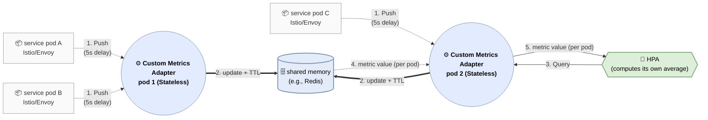

# Introduction

This document argues that active requests are a better single HPA metric than CPU and memory, and describes how a custom metrics server can avoid KEDA's collection latency to achieve very fast autoscaling. Compared with the conventional Metrics Server approach, it can detect load 20 seconds to more than one minute earlier, making it especially effective for traffic spikes.

# Summary

- An Activescale-based HPA has scaling-decision latency comparable to KPA (Knative Pod Autoscaler) in principle.
  - KPA is purely event-driven, while HPA polls every 15 seconds and therefore retains a 15-second penalty.
  - In return for that 15-second delay, Activescale removes KPA's architectural complexity.

- Advantages compared with other approaches

  | Stage | Conventional approach (Metrics Server) | Active requests + KEDA | Activescale |
  |----|----|----|----|
  | **Load-detection latency** (time to produce a threshold signal) | CPU/Memory: **10-60s** | Active requests: **immediate** | Active requests: **immediate** |
  | **Collection/aggregation latency** | Metrics Server scrape interval: **15-60s** (60s by default; tunable) | Prometheus scrape interval: **60s** (default; tunable) | Envoy push: **5s + α** (Envoy's default `stats_flush_interval`; effectively not tunable. α is the custom metrics server processing time and is less than 1s.) |
  | **Decision latency** | HPA: **15s** (unlike upstream Kubernetes, this cannot be tuned on EKS and similar platforms) | HPA + KEDA: **25-45s** (KEDA defaults to 30s; tunable) | HPA: **15s** |
  | Total latency | 40-135s | 85-105s | 20s + **α** |
  | **Improvement and implications** | Baseline | **-45s to 30s; collection, aggregation, and decision latency can make this slower than the conventional approach** | **20-115s - α** |

# Failure-Signal Sequence During a Load Spike

This section shows that active-request and connection metrics detect overload at stage 1, while tail latency begins signaling it at stage 3, CPU at stage 5, and memory at stage 6.

- **Concurrent requests (in flight) increase** → queueing/waiting increases → **tail latency increases** → cost efficiency degrades → GC/memory pressure increases → CPU saturation/throttling increases → timeouts/retries increase → OOM/crash
- When an active-request metric is unavailable, tail latency (P95/P99) is a useful leading indicator.

| Stage | Typical timestamp\* | Core symptom | Envoy / Istio metrics | Kubernetes / node metrics |
|----|----|----|----|----|
| 0. Normal | t0 | Normal processing | Stable `envoy_http_downstream_rq_active` | CPU throttling at 0; stable `container_memory_working_set_bytes` |
| 1. Ingress pressure | t0 to t+2s | **Sharp increase in concurrent requests** | `envoy_http_downstream_rq_active` ↑, `envoy_http_downstream_cx_active` ↑ | No significant change yet |
| 2. Soft saturation | t+2s to t+5s | Queueing begins | `envoy_cluster_upstream_rq_pending_*` ↑ | Internal queue depth ↑ when the application has a queue |
| 3. Tail latency | t+5s to t+10s | **P95/P99 ↑** | P95/P99 of `istio_request_duration_milliseconds_bucket` ↑ | CPU still has headroom |
| 4. Queue acceleration | t+10s to t+20s | Waiting grows rapidly | Both pending and active requests increase rapidly | Node load/run queue slightly ↑ |
| 5. Higher CPU cost | t+20s to t+40s | Context-switch overhead | P99 latency accelerates | Rate of `container_cpu_usage_seconds_total` ↑ |
| 6. Memory pressure | t+30s to t+60s | RSS increases because of in-flight buffers | Latency continues to degrade | `container_memory_working_set_bytes` ↑ |
| 7. GC/runtime pressure | t+40s to t+90s | GC frequency/duration ↑ | Throughput slows (rate of `istio_requests_total` ↓) | GC metrics ↑, CPU rises further |
| 8. CPU saturation | t+1m to t+2m | Throttling/100% utilization | Early signs of errors | `container_cpu_cfs_throttled_seconds_total` ↑↑ |
| 9. Timeouts/retries | t+2m to t+3m | 5xx/timeouts surge | `istio_requests_total{response_code=~"5..0"}` ↑, `envoy_cluster_upstream_rq_timeout` ↑ |  |
| 10. Kernel bottleneck | t+3m to t+4m | Backlog/conntrack pressure | `envoy_http_downstream_cx_active` remains abnormally high | Conntrack and socket-buffer pressure |
| 11. OOM/crash | t+3m onward | Process exits | Throughput collapses | `container_oom_events_total`, `OOMKilled` events |

# Why Active Requests?

- **Little's Law:** $L(active\;request) = λ(RPS)×W(latency)$. Active requests therefore reflect both throughput and latency: the value rises when either throughput or latency rises.
- **A much better signal than CPU or memory:** Active requests can produce a threshold signal *10-60 seconds before* an incident, while CPU and memory usually do so only immediately before or after the incident. Memory is especially slow for scale-in.
  - **CPU and memory signals are delayed for these reasons:**
    - **Cumulative and averaged metrics:** CPU and memory signals appear only after an average accumulated over a time window crosses a threshold, rather than at the moment an event occurs.
    - **Runtime buffering:** GC, caches, and buffers temporarily absorb overload and delay the signal until resources are nearly exhausted.
    - **Nonlinear growth after saturation:** CPU throttling, page faults, and reclaim activity rise sharply only after performance has already degraded.
  - **Scale-in is even more delayed for CPU and memory:**
    - **Residual averages:** After load drops, previous high values remain mixed into the current window and keep the metric elevated.
    - **Delayed memory release:** Heaps, caches, and the page cache are not reclaimed immediately, so the working set remains high after request volume falls.
    - **Asymmetric response:** CPU falls relatively quickly, while memory decreases gradually and produces a particularly slow scale-in signal.
- **Runtime-independent:** The metric works across runtimes such as Java, Go, and Python.
- **KPA's single metric:** **Concurrent requests are KPA's default single metric.** KPA is effectively the de facto standard for Kubernetes-based serverless workloads.

> **Concurrent requests = active requests + pending requests**
>
> - **Active requests:** In-flight requests that Envoy has forwarded upstream and that are currently being processed.
> - **Pending requests:** Requests waiting in an upstream queue because an upstream connection or slot is unavailable. Envoy/Istio exposes this only for upstream traffic, not downstream traffic.
> - **`istio_requests_total`:** Counts completed requests, while concurrent requests count requests that are processing or waiting.

# An Alternative to KPA: Istio + KEDA

KPA supports zero minimum replicas and request queueing through its activator, which KEDA does not provide. However, it forces every Pod to run a dedicated Queue Proxy sidecar and uses a separate Envoy instance to obtain active-request metrics, even though Istio could provide them. Adding another sidecar on top of Envoy is operationally awkward. Therefore:

- **Practical compromise:** Use KEDA with Istio Envoy's `envoy_http_downstream_rq_active` metric. Without request queueing, this cannot prevent dropped requests.
- Use only `envoy_http_downstream_rq_active` for scale-out, and combine it with `stabilizationWindowSeconds` for scale-in to prevent thrashing.
- KPA follows the same philosophy, except that request queueing provides stability instead of `stabilizationWindowSeconds`.

KEDA has **its own polling interval and also depends on the collection interval of a dedicated database such as Prometheus**. Waiting for both intervals makes very fast scaling impossible and can even make scaling slower.

# Addressing the Limitation: Introduce a Custom Metrics Server



## How It Works

The Custom Metrics Server replaces Prometheus for this path. It aggregates metrics immediately, keeps them in memory, and responds as soon as the HPA queries them. Istio/Envoy pushes metrics instead of relying on scraping, which removes polling delay.

Each metric also has a **TTL (Time-To-Live)** to minimize stale data when a Pod terminates abnormally.

**Note:** A metric sink must implement the Envoy Metric Service protocol. The following example configures Istio Proxy (Envoy) to push metrics to the custom metrics server.

```yaml
apiVersion: networking.istio.io/v1beta1
kind: ProxyConfig
metadata:
  name: metrics-push
  namespace: istio-system
spec:
  envoyMetricsService:
    address: custom-metric.observability.svc.cluster.local:9000

  proxyStatsMatcher:
    inclusionRegexps:
      - ".*downstream_rq_active.*"
      - ".*downstream_cx_active.*"
```

## The High-Availability and Shared-Memory Problem

The Custom Metrics Server is a critical component and therefore must be highly available. Implementing shared memory within the server is difficult for these reasons:

- **Distributed aggregation:** Metrics can arrive at different Custom Metrics Server replicas, requiring synchronization across replicas to compute the complete result.
- **Consistent hashing:** Both Envoy metric pushes and HPA queries would need to locate the replica responsible for a specific Pod.
- **Solution:** Use **Redis as shared memory** instead of operating custom distributed logic.
- **Architecture:** The Custom Metrics Server provides only the gRPC/HTTP interfaces, while Redis owns all state. This makes the server replicas fully stateless and suitable for HA deployment.

## Implementation Direction

Expose two endpoints: one for Istio/Envoy and one for kube-apiserver. Implement the service in Go because both ecosystems have mature Go libraries.

### Istio/Envoy API Logic

<https://github.com/envoyproxy/go-control-plane>

1. Receive a gRPC `StreamMetrics` request.
2. Resolve the Pod and namespace from `node.metadata` or the Istio `node.id` fallback.
3. Refresh the Pod heartbeat, then classify and aggregate Envoy statistics as `inbound_active_requests`, `outbound_active_requests`, and `active_connections`.
4. Store each value in Redis under `{context, namespace, pod, metric}` with a TTL.

### kube-apiserver API Logic

<https://github.com/kubernetes-sigs/custom-metrics-apiserver>

- Use the [Custom Metrics API](https://kubernetes.io/docs/reference/external-api/custom-metrics.v1beta2/) because another `APIService`, such as KEDA, may already use the [External Metrics API](https://kubernetes.io/docs/reference/external-api/external-metrics.v1beta1/). This means another Custom Metrics Adapter, such as Prometheus Adapter, cannot be used at the same time; KEDA remains an option when that is required.
- When a request such as `GET /apis/custom.metrics.k8s.io/v1beta2/namespaces/default/pods/*/inbound_active_requests?labelSelector=...` arrives, query Redis by namespace, Pod, and metric name.
- Return the requested metric as a **list of per-Pod values** for the target Deployment so the HPA can calculate the average. `outbound_active_requests` and `active_connections` use the same response shape.

# Related Kubernetes Manifest Example

The APIService and the HPA that uses Activescale metrics are taken from `k8s-manifest-example.yaml`, with explanatory comments added.

## APIService

```yaml
apiVersion: apiregistration.k8s.io/v1
kind: APIService
metadata:
  name: v1beta2.custom.metrics.k8s.io
spec:
  group: custom.metrics.k8s.io
  version: v1beta2
  service:
    name: activescale
    namespace: observability
  groupPriorityMinimum: 100
  versionPriority: 200
  caBundle: REPLACE_WITH_BASE64_SERVER_CERT # Base64-encoded serving certificate PEM
```

## HPA

```yaml
apiVersion: autoscaling/v2
kind: HorizontalPodAutoscaler
metadata:
  name: my-svc-hpa
  namespace: default
spec:
  scaleTargetRef:
    apiVersion: apps/v1
    kind: Deployment # StatefulSet is also supported
    name: my-svc
  minReplicas: 2
  maxReplicas: 50
  metrics:
    - type: Pods
      pods:
        metric:
          name: inbound_active_requests # In-flight requests exposed per Pod by custom.metrics.k8s.io
        target:
          type: AverageValue
          averageValue: "10" # Scale out when average inbound_active_requests per Pod exceeds 10
    # With multiple metrics, the HPA selects the largest desired replica count.
    - type: Pods
      pods:
        metric:
          name: active_connections # Open connections exposed per Pod by custom.metrics.k8s.io
        target:
          type: AverageValue
          averageValue: "20" # Scale out when average active_connections per Pod exceeds 20
```
