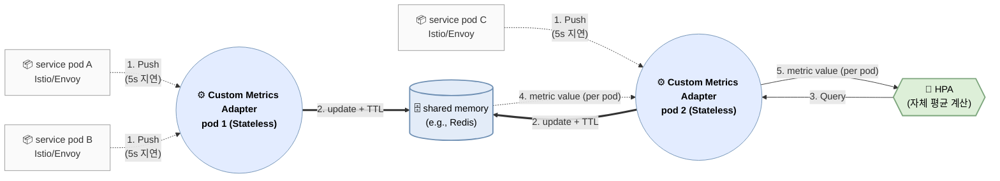

# Introduction

Active request를 CPU + Memory를 대신하는 HPA의 단일 지표로 쓰는 것이 좋다는 주장과 함께, KEDA의 약점인 수집 지연 개선을 위한 custom metric server를 도입함으로 초고속 autoscaling을 얻기 위한 방법을 논한다. 기존 방식(Metric Server 기반)보다 짧게는 20s, 길게는 1분 이상 먼저 부하 인지가 가능하여 Spike 대응에 매우 효과적이다.

# Summary

- activescale 기반 HPA는 원리적 관점에서 사실 상 KPA(Knative Pod Autoscaler)와 유사 수준의 scale 판단 지연 효과를 가짐
  - KPA는 순수 event driven인 반면 HPA는 15s 주기의 polling 기반이므로 15s 패널티는 유지
  - 다만 KPA의 아키텍처 복잡성을 제거하므로 15s 지연 penalty와 복잡성 간의 trade-off를 이룸.

- 본 건의 장점(타 방식과의 비교)

  | 단계 | 기존 방식 (Metrics Server) | active request + KEDA 방식 | activescale 방식 |
  |----|----|----|----|
  | **부하 인지**(임계 신호 생성) **지연** | CPU/Memory: **10~60s** | active request: **즉시** | active request: **즉시** |
  | **수집/집계 지연** | metric server scrape interval: **15 ~ 60s** (default 60s; tuning 가능) | prometheus scrape interval: **60s** (default; tuning 가능) | Envoy push: **5s + α** (Envoy default - `stats_flush_interval`; tuning 사실 상 불가, α는 custom metric server 처리 지연, 1s 미만) |
  | **인지 지연** | HPA: **15s** (k8s 순정과는 달리, EKS 등에서 tuning 불가) | HPA + KEDA: **25s ~ 45s** (KEDA default: 30s. tuning 가능) | HPA: **15s** |
  | 지연 총합 | 40 ~ 135s | 85s ~ 105s | 20s + **α** |
  | **개선 효과 및 시사점** | 기준선 | **-45s ~ 30s 수집, 집계, 인지 지연으로 인해 기존 방식보다 더 느릴 수도** | **20s ~ 115s - α** |

# 부하 급증 시 장애 신호의 발생 순서

이 섹션은 active request/connection metric이 1단계에서 과부하를 포착하는 반면, tail latency는 3단계, CPU는 5단계, memory는 6단계부터 신호를 드러내는 시간 차이를 보여줌.

- **동시요청(in-flight) ↑** → 큐/대기 ↑ → **tail latency ↑** → (비용구조 악화) → GC/메모리 압력 ↑ → CPU saturation/스로틀링 ↑ → 타임아웃/리트라이 ↑ → OOM/크래시
- tail latency(P95/P99)는 active request 지표가 없을 경우 매우 유용한 선행 지표

| 단계 | 일반적 timestamp\* | 현상(핵심) | Envoy / Istio 메트릭 | K8s / 노드 메트릭 |
|----|----|----|----|----|
| 0. 정상 | t0 | 정상 처리 | `envoy_http_downstream_rq_active` 안정 | CPU throttling 0, `container_memory_working_set_bytes` 안정 |
| 1. 유입 압력 | t0 ~ t+2s | **동시요청 급증** | `envoy_http_downstream_rq_active` ↑, `envoy_http_downstream_cx_active` ↑ | 아직 큰 변화 없음 |
| 2. 소프트 포화 | t+2s ~ t+5s | 대기/큐 생성 | `envoy_cluster_upstream_rq_pending_*` ↑ | (앱 큐 있으면) 내부 queue depth ↑ |
| 3. Tail latency | t+5s ~ t+10s | **p95/p99↑** | `istio_request_duration_milliseconds_bucket` p95/p99 ↑ | CPU는 아직 여유 |
| 4. 큐 가속 | t+10s ~ t+20s | 대기 폭증 | pending, active 둘 다 급증 | node load/runqueue 약간 ↑ |
| 5. CPU 비용 악화 | t+20s ~ t+40s | context-switch/overhead | latency p99 급가속 | `container_cpu_usage_seconds_total` 증가율↑ |
| 6. 메모리 압력 | t+30s ~ t+60s | in-flight 버퍼로 RSS↑ | 지연 악화 지속 | `container_memory_working_set_bytes` ↑ |
| 7. GC/런타임 | t+40s ~ t+90s | GC 빈도/시간↑ | 처리율 둔화(`istio_requests_total` 증가율↓) | GC 메트릭↑, CPU 더 상승 |
| 8. CPU 포화 | t+1m ~ t+2m | throttling/100% | 에러율 전조 | `container_cpu_cfs_throttled_seconds_total` ↑↑ |
| 9. 타임아웃/리트라이 | t+2m ~ t+3m | 5xx/timeout 폭증 | `istio_requests_total{response_code=~"5..0"}` ↑, `envoy_cluster_upstream_rq_timeout` ↑ |  |
| 10. 커널 병목 | t+3m ~ t+4m | backlog/conntrack | `envoy_http_downstream_cx_active` 비정상 유지 | conntrack, socket buffer pressure |
| 11. OOM/크래시 | t+3m ~ 수분 | 프로세스 종료 | 처리량 급락 | `container_oom_events_total`, `OOMKilled` 이벤트 |

# 왜 Active Request인가?

- **리틀의 법칙(Little’s Law):** $L(active\;request) = λ(RPS)×W(latency)$에 근거. 즉, active request는 처리량과 지연 모두를 반영하는 지표임. 처리량이 올라가도 증가하고, 지연이 증가해도 올라가는 지표.
- **CPU / memory보다 지표로 매우 우수**: active request는 장애가 터지기 *10~60초 전에* 먼저 임계 신호를 만드는 반면, CPU·memory는 장애 후 또는 직전에야 만듦. 특히 memory는 scale-in 관점에서도 지나치게 느림.
  - **CPU/Memory는 하기 이유로 지연이 발생**
    - **누적·평균 지표 구조:** CPU/Memory는 순간 이벤트가 아니라 *특정 시간 window 동안 누적된 사용량의 평균*이 임계치를 넘을 때만 신호가 만들어짐.
    - **런타임 완충 메커니즘:** GC,캐시, 버퍼 등으로 과부하를 잠시 흡수해 *실제 고갈 전까지 임계 신호 생성을 지연*.
    - **포화 이후 비선형 증폭:** CPU throttling, page fault, reclaim 같은 현상은 *이미 성능이 무너진 뒤에야* 급격히 지표가 튐.
  - **scale-in의 경우는 더욱 크게 CPU, Memory에서 지연이 발생**
    - **누적·평균 잔상:** 부하가 줄어도 CPU/Memory는 *이전 window의 높은 사용량이 섞여* 한동안 높은 값으로 남음.
    - **메모리 반환 지연:** 요청이 줄어도 힙·캐시·page cache가 *즉시 회수되지 않아* working set이 오래 유지.
    - **비대칭 반응성:** CPU는 비교적 빨리 내려오지만, Memory는 *하강 경로가 매우 완만*해 scale-in 신호 생성이 특히 늦어짐.
- **runtime 환경 의존성 없음**: runtime 환경(e.g. java, go, python)에 대한 의존성이 없어 universal하게 사용 가능
- **KPA의 단일 지표**: **concurrent request는 KPA(Knative Pod Autoscaler)의 단일 지표**로 사용 중(default의 경우). KPA는 k8s 기반 서버리스 운용의 사실상 de facto 표준임.

> **concurrent request = (active + pending) request**
>
> - **active request:** Envoy가 현재 업스트림으로 전달되어 실제 처리 중인 in-flight 요청
> - **pending request:** 업스트림 커넥션/슬롯 부족 등으로 아직 전달되지 못하고 upstream 큐에서 대기 중인 요청(envoy/istio에는 downstream에는 없고, 오직 upstream에만 존재)
> - **`istio_requests_total`**: 완료 기준. concurrent request는 처리/대기 중 기준.

# KPA의 대안: Istio + KEDA의 조합

KPA는 HPA 대비 0개의 min replica와 함께 KEDA도 제공하지 못하는 Request Queuing(activator)을 지원하지만, **모든 Pod에 전용 sidecar(Queue Proxy)를 강제**하고 active request 수집을 위해 별도 Envoy를 사용함. 기존 Envoy 외에 Pod별 sidecar를 추가해야 하는 운영 부담이 존재.

- **현실적 타협**: Istio Envoy가 기본으로 제공하는 active request 지표인 `envoy_http_downstream_rq_active` + KEDA 사용. Request Queuing 기능이 없어 request 유실 방지는 못함.
- Autoscaling은 `envoy_http_downstream_rq_active`**만으로 scale-out**하고, **scale-in은** `envoy_http_downstream_rq_active` **+** `stabilizationWindowSeconds`으로 thrashing을 방지
- KPA도 같은 철학이며, `stabilizationWindowSeconds` 대신 request queuing으로 안정성을 확보한다는 차이만 존재.

KEDA는 **자체 polling 주기를 가질 뿐 아니라, 전용 DB(Prometheus 등)의 수집 주기**에 종속됨. **두 주기를 모두 기다리면 초고속 scaling이 불가능하며 기존 방식보다 느려질 위험도 존재.**

# 상기 한계의 해결: Custom Metric Server 도입



## 동작 원리

Custom Metric Server는 Prometheus를 대신하여 metric을 즉시 합산하여 메모리에 들고 있다가, HPA가 요청하면 즉시 응답. 또한, Metric scraping 대신 Istio/Envoy가 metric을 push함으로 polling에 따른 지연 제거.

추가로, Pod 비정상 종료를 대비해 각 지표에 **TTL(Time-To-Live)**을 적용함으로 비정상 데이터 제공 최소화.

**Note**: Envoy Metric Service의 프로토콜에 따라 metric sink 구현이 요구됨. 다음은 Istio Proxy(Envoy)에서 custom metric server로 metric push를 위한 설정 예.

```yaml
apiVersion: networking.istio.io/v1beta1
kind: ProxyConfig
metadata:
  name: metrics-push
  namespace: istio-system
spec:
  envoyMetricsService:
    address: custom-metric.observability.svc.cluster.local:9000

  proxyStatsMatcher:
    inclusionRegexps:
      - ".*downstream_rq_active.*"
      - ".*downstream_cx_active.*"
```

## 고가용성(HA)과 Shared Memory의 난제는 어떻게?

Custom Metric Server는 핵심 컴포넌트이기에 HA 구성이 필수적이지만, 다음 이유로 **자체 shared Memory 구현**은 난감.

- **분산 합산의 어려움**: 지표가 여러 Aggregator 복제본으로 분산되어 들어올 때, 전체 합산값을 구하기 위해 복제본 간 데이터 동기화가 필요.
- **Consistent Hashing 요구**: Envoy가 지표를 보낼 때나, HPA가 조회할 경우 모두에서 특정 pod를 찾아가야하는 consistent hashing 요구 발생.
- **해법**: 복잡한 분산 로직 운영 대신 **Redis를 shared Memory로 사용.**
- **구조**: Custom Metric Server는 단순한 인터페이스(gRPC/HTTP) 역할만 수행하며, 모든 상태는 Redis가 관리. 이를 통해 완전한 무상태(Stateless) HA 구성이 가능.

## 구현 방향

Istio/Envoy와 kube-apiserver용의 2개의 endpoints 노출. 관련 생태계가 golang이 잘 되어 있으므로 golang기반으로 구현.

### Istio/Envoy용 API bizlogic

<https://github.com/envoyproxy/go-control-plane>

1. gRPC `StreamMetrics` 요청 수신
2. `node.metadata` 또는 Istio `node.id`에서 Pod와 namespace 식별
3. Pod heartbeat 갱신 후 Envoy 통계를 `inbound_active_requests`, `outbound_active_requests`, `active_connections`로 분류·합산
4. 각 값을 key = `{context, namespace, pod, metric}`으로 Redis에 저장(TTL 포함)

### kube-apiserver용 API bizlogic

<https://github.com/kubernetes-sigs/custom-metrics-apiserver>

- [External metrics API](https://kubernetes.io/docs/reference/external-api/external-metrics.v1beta1/)는 KEDA 등 타 `APIService`가 사용할 가능성이 높으므로 [Custom metrics API](https://kubernetes.io/docs/reference/external-api/custom-metrics.v1beta2/) 사용(대신 타 Custom metrics Adapter를 못 씀. 예컨데 Prometheus Adapter - 이게 필요하면 KEDA 쓰면 되긴 하지만).
- `GET /apis/custom.metrics.k8s.io/v1beta2/namespaces/default/pods/*/inbound_active_requests?labelSelector=...` 같은 요청 수신
- namespace, Pod, metric 이름으로 Redis 조회
- HPA 대상 Deployment의 각 Pod에 대해 요청한 metric 값을 **리스트로 반환**하여 HPA가 평균 계산. `outbound_active_requests`, `active_connections`도 동일한 형식으로 제공

# 관련 Kubernetes manifest 예시

`k8s-manifest-example.yaml`에서 APIService와 Activescale metric을 사용하는 HPA를 발췌하고 설명 주석을 추가함.

## APIService

```yaml
apiVersion: apiregistration.k8s.io/v1
kind: APIService
metadata:
  name: v1beta2.custom.metrics.k8s.io
spec:
  group: custom.metrics.k8s.io
  version: v1beta2
  service:
    name: activescale
    namespace: observability
  groupPriorityMinimum: 100
  versionPriority: 200
  caBundle: REPLACE_WITH_BASE64_SERVER_CERT # Serving certificate PEM의 base64 값
```

## HPA

```yaml
apiVersion: autoscaling/v2
kind: HorizontalPodAutoscaler
metadata:
  name: my-svc-hpa
  namespace: default
spec:
  scaleTargetRef:
    apiVersion: apps/v1
    kind: Deployment # StatefulSet도 가능
    name: my-svc
  minReplicas: 2
  maxReplicas: 50
  metrics:
    - type: Pods
      pods:
        metric:
          name: inbound_active_requests # custom.metrics.k8s.io가 Pod별로 제공하는 처리 중 request 수
        target:
          type: AverageValue
          averageValue: "10" # Pod당 평균 inbound_active_requests 10 초과 시 scale-out
    # 다른 metric을 함께 설정하면 metric별 desired replicas 중 가장 큰 값 선택
    - type: Pods
      pods:
        metric:
          name: active_connections # custom.metrics.k8s.io가 Pod별로 제공하는 열린 connection 수
        target:
          type: AverageValue
          averageValue: "20" # Pod당 평균 active_connections 20 초과 시 scale-out
```
