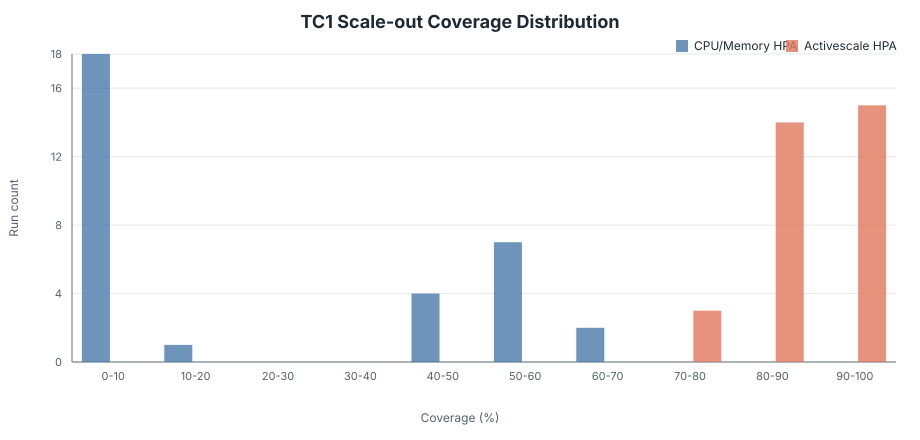
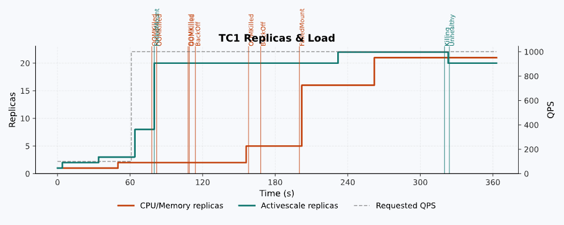
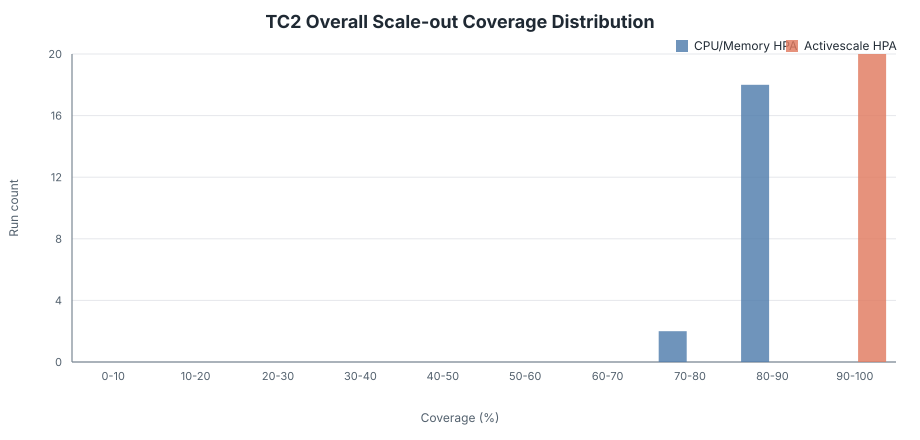
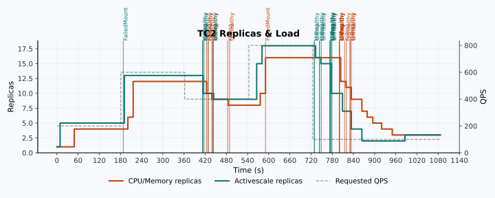

# Activescale HPA vs CPU/Memory HPA Overall Test Summary

## Introduction

This document compares scaling delays across 13 TC1 samples evaluating both HPAs, Scale-out Coverage across 32 TC1 and 20 TC2 samples, and estimated resource utilization based on those results.

For reference, Scale-out Coverage is the share of the ideal replica × time area actually satisfied during scale-out; values closer to 100% indicate a faster and more complete response to rising load.

## Summary

### TC1: Sudden Large-Spike Response Validation

A 10x increase from 100 to 1,000 QPS.

| HPA | Scaling start delay<br>(13 samples) | Time to maximum replicas<br>(13 samples) | Scale-out Coverage<br>(32 samples) | Estimated resource utilization |
| --- | --- | --- | --- | --- |
| CPU/Memory HPA | 33s to ∞<br>median 64s<br>2 samples failed | 33s to ∞<br>median 186s | median 5.66%<br>0.00% in 12/32 samples | 30% baseline |
| Activescale HPA | 3s to 34s<br>median 17s | 19s to 262s<br>median 34s | median 89.47%<br>higher in 32/32 samples | 113.1% estimate<br>276.84% median relative increase |

- **Key difference**: scaling starts 47s sooner and maximum replicas are reached 152s (2m 32s) sooner. Activescale reaches maximum replicas first in every comparison.
- **Sample illustrating the spike-response difference between the two HPAs**
  - **Activescale HPA**: scaling starts in 3s, reaches near-maximum Pods in 25s, and accepts the spike load.
  - **CPU/Memory HPA**: scaling starts after 1m 30s, near-maximum Pods are still not reached at 3m, and failure progresses during the delay.

### TC2: Realistic Traffic-Change Response Validation

50 QPS warmup → 200 → 600 → 400 → 800 → 100 QPS scale-in.

| HPA | Scale-out Coverage (20 samples) | Estimated resource utilization |
| --- | --- | --- |
| CPU/Memory HPA | median 84.50% | 30% baseline |
| Activescale HPA | median 96.30%, higher in 20/20 samples | 55.6% estimate, 85.32% median relative increase |

- **Key difference**: median Coverage improves by 11.80 percentage points. In the TC2 sample, scale-out detection is 10s faster and scale-in detection is 71s faster.
- **Sample illustrating the traffic-response difference between the two HPAs**
  - **Activescale HPA**: scale-out detection/peak arrival 10s/400s, scale-in detection/minimum arrival 8s/139s, average/peak replicas 9.2/18.
  - **CPU/Memory HPA**: scale-out detection/peak arrival 20s/410s, scale-in detection/minimum arrival 79s/225s, average/peak replicas 8.8/16.

## TC1: Sudden Large-Spike Response Validation

### Scaling Responsiveness Comparison Across 13 Samples

Activescale HPA consistently starts scaling and reaches maximum replicas earlier.

- **Scaling start delay**
  - **Activescale HPA**: range 3s to 34s, median 17s.
  - **CPU/Memory HPA**: range 33s to ∞, median 64s. Scaling failed in 2 samples.
  - **Median reduction**: 47s.
- **Time to maximum replicas**
  - **Activescale HPA**: range 19s to 262s, median 34s.
  - **CPU/Memory HPA**: range 33s to ∞, median 186s.
  - **Median reduction**: 152s (2m 32s), with Activescale ahead in every comparison.

### Scale-out Coverage Across 32 Samples

- **CPU/Memory HPA Coverage**: min 0.00%, median 5.66%, max 63.54%; 0.00% in 12 of 32 samples (effectively no scale-out).
- **Activescale HPA Coverage**: min 75.88%, median 89.47%, max 97.86%; higher in all 32 samples.



<div style="text-align: center;"><small>Figure 1. Scale-out Coverage distribution across 32 TC1 samples.</small></div>

### Estimated Resource Utilization

- **CPU/Memory HPA resource utilization**: 30% baseline example.
- **Activescale HPA resource utilization**: 113.1% estimate.
- **Relative increase**: min 110.91%, median 276.84%, max 839.35%.

### Sample Illustrating Spike-Response Differences

- **Activescale HPA**: scaling starts in ~3s, near-maximum Pods in ~25s, spike load accepted.
- **CPU/Memory HPA**: scaling starts after ~1m 30s, near-maximum Pods still not reached at 3m, failure progresses during delay.



<div style="text-align: center;"><small>Figure 2. Requested QPS and replica changes in a single TC1 sample illustrating the spike-response difference between the two HPAs.</small></div>

## TC2: Realistic Traffic-Change Response Validation

### Aggregate Results Across 20 Samples

- **CPU/Memory HPA overall Coverage**: min 78.62%, median 84.50%, max 87.95%.
- **Activescale HPA overall Coverage**: min 94.33%, median 96.30%, max 98.77%; higher in all 20 samples.



<div style="text-align: center;"><small>Figure 3. Overall Scale-out Coverage distribution across 20 TC2 samples.</small></div>

### Estimated Resource Utilization

- **CPU/Memory HPA resource utilization**: 30% baseline example.
- **Activescale HPA resource utilization**: 55.6% estimate.
- **Relative increase**: min 59.10%, median 85.32%, max 124.80%.

### Sample Illustrating Traffic-Response Differences

- **Activescale HPA**: scale-out detection/peak arrival 10s/400s, scale-in detection/minimum arrival 8s/139s, average/peak replicas 9.2/18.
- **CPU/Memory HPA**: scale-out detection/peak arrival 20s/410s, scale-in detection/minimum arrival 79s/225s, average/peak replicas 8.8/16.



<div style="text-align: center;"><small>Figure 4. Replica changes in a TC2 sample illustrating the traffic-response difference between the two HPAs during the 200→600→400→800→100 QPS sequence.</small></div>

## Interpretation Boundaries

- In TC1 scaling-delay results, ∞ means that scaling did not start or maximum replicas were not reached within the evaluation window.
- Coverage does not evaluate scale-in; intervals where traffic decreases are excluded.
- Target replicas assume a linear QPS-to-replica relationship and may be distorted in nonlinear regions.
- Resource utilization is an estimate based on reduced pre-provisioned buffer requirements under the same baseline load and is not a general performance guarantee.

## Appendix: Formulas

Scale-out Coverage is the fraction of the ideal scale-out area actually satisfied by replicas. The area is measured in replica × time, and values closer to 100% indicate faster scale-out.

### Coverage Formulas

```text
TC1:
C = (
      1
      - D / ∫[t0..t1] (R_target(t) - R_base) dt
    ) × 100
```

```text
TC2:
C_overall = (
              1
              - (D_1 + D_2) / (A_1 + A_2)
            ) × 100
```

- **D**: unmet replica × time area relative to ideal scale-out
- **A**: total ideal scale-out replica × time area
- **R_target**: target replica count estimated from a linear QPS-to-replica relationship

### Estimated Resource Utilization Increase Formula

```text
B_m = D_m / T_m

U = (
      (R_base + B_CM) / (R_base + B_AS)
      - 1
    ) × 100
```

- **B_m**: equivalent buffer for mode m, converting unmet area into average missing replicas
- **U**: estimated resource utilization increase of Activescale HPA over CPU/Memory HPA under the same baseline load
